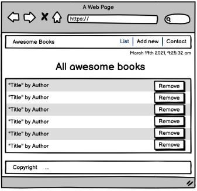
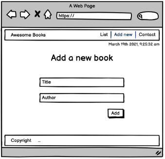
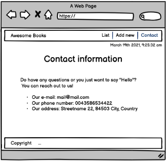

> Hello! I am a software developer! I can help you build a product, feature or website. Take a look of my works.
> If you like what you see and have a project you need coded, don’t hesitate and contact me.

# Awesome books.

"Awesome books" is a simple website that displays a list of books and allows you to add and remove books from that list. By building this application, you will learn how to manage data using JavaScript. Thanks to that your website will be more interactive. You will also use a medium-fidelity wireframe to build the UI.

  

## Built With

- HTML
- CSS
- JavaScript (using ES6 modules and classes)

## Live Demo

[Live Demo Link](https://rbanos-mv.github.io/awesome-books-es6/)

### Prerequisites

- Create a collection that keeps a list of books.
- Create a function to add a new book to the collection, with title and author.
- Create a function to remove a book from the collection.
- Display all books saved in the collection in the top part of the page.
- Make sure that when a user clicks the "Add" button.
  Make sure that when a user clicks the "Remove" button.
- Make sure that data is preserved in the browser's memory by using localStorage.

## Authors

👤 **Roberto A. Baños Alvarez**

- GitHub: [@rbanos-mv](https://github.com/rbanos-mv)
- Twitter: [@RobertoBanosMV](https://twitter.com/RobertoBanosMV)
- LinkedIn: [Roberto A Baños Alvarez](https://linkedin.com/in/roberto-a-baños-alvarez-500766234)

## 🤝 Contributing

Contributions, issues, and feature requests are welcome!

Feel free to check the [issues page](https://github.com/rbanos-mv/awesome-books-es6/issues).

## Show your support

Give a ⭐️ if you like this project!

## Acknowledgments

- Microverse README template.
- Figma.

## 📝 License

This project is [MIT](./MIT.md) licensed.
